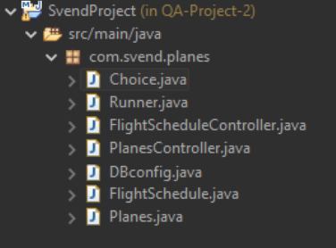
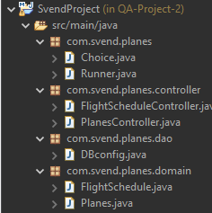
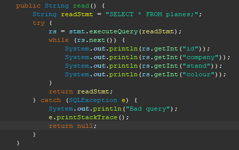
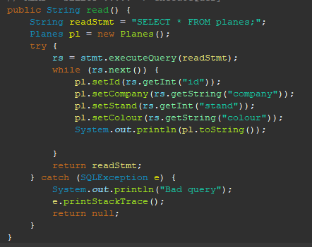
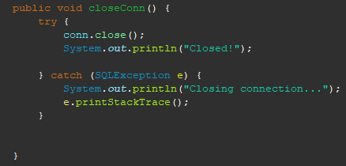
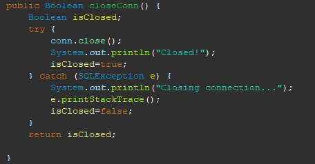

# Atos Project by Svend

##How to install?
1. Clone the repo to a directory of your choice (using git clone)
2. Verify that java is installed on your computer
3. Open up a command prompt and navigate to cloned repo, ensuring you are located within the folder that holds the .jar file (/target)
4. Type '''java -jar SvendProject-0.0.1-SNAPSHOT-jar-with-dependencies'''
5. Enjoy!

##How to test?
1. Clone the repo to a directory of your choice (using git clone)
2. Open the Eclipse IDE and head to File > Import > Import Existing Maven Project and select the cloned git repo.
3. Navigate to 'src/test/java' and right click on either test classes and click 'Run JUnit Test'
4. Since there are two test classes, it might be easier to set the coverage configurations to run both test classes.
5. Enjoy!

#Screenshots

##Overall Structure
The structure of the program went from having all the clases held within the com.svend.planes folder directory to
having seperate package structure for each group of classes. This can be seen in the following screenshot: 
 
 Before
 
 
 
 After
 

##Controllers
Both of the controllers for each of the respective databases utilize OOD by heavily referencing objects throughout
CRUD functionality. This was not the case initially however, and through iterations the program gradually
became more object oriented. 

Below, you can see an example of the read method which, instead of printing each column out like it did previously, saves all the details
to an object and prints the object.

Before

After

##Testing
Initially, the project was developed mostly with static methods which meant that testing could not be sufficiently done. 
Each method was altered to have a return type which could result in accurate testing - for some this was simply ensuring the SQL syntax was correct, and for
others this involved checking that objects were being created as intended.

Initial method with no return type

After adding a return type for testing

